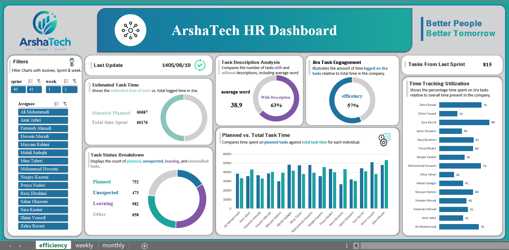
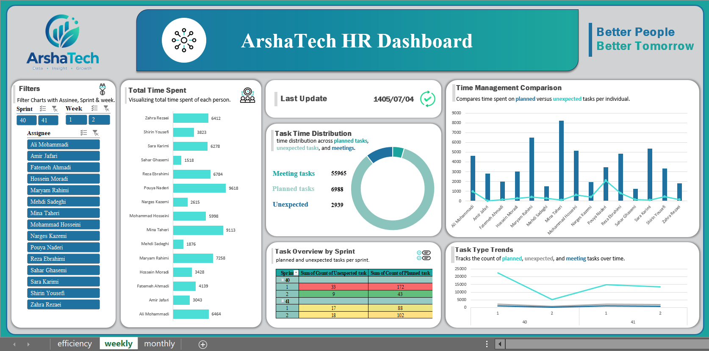

# Project Control Reports

A modular Python toolkit for automating project management reporting workflows. It transforms raw Jira exports and Excel planning files into actionable insights: sprint health metrics, team productivity breakdowns, task classification, and attendance summaries.

Built to eliminate hours of manual spreadsheet work — turning recurring PM reporting into a single-command pipeline.

## Why This Project

Project managers spend too much time copy-pasting between Jira exports, planning sheets, and Excel dashboards. This toolkit automates the entire flow:

- Combines multiple project reports into one unified dataset
- Classifies every task as planned, unexpected, or meeting
- Computes sprint-level metrics (failure rate, bug ratio, meeting density)
- Aggregates productivity per team member with time breakdowns
- Exports formatted Excel reports with conditional highlighting

Everything runs locally, needs no external service, and works with standard Jira CSV exports.

## Preview





## Features

- **Multi-project aggregation** — Merge unlimited Jira CSV exports into a single monthly report
- **Sprint transition analysis** — Build a directed graph of sprint-to-sprint task movement
- **Task classification** — Auto-detect planned (`SxxWx-N`), unexpected, and meeting tasks
- **Team productivity report** — Per-assignee time spent on planned / unexpected / meeting tasks
- **Weekly task tracking** — Compare actual time vs. planned time with color-coded progress
- **Attendance extraction** — Parse monthly Excel attendance sheets into clean structured output
- **Configurable paths** — All paths and patterns centralized at the top of each script
- **Excel formatting** — Conditional highlighting for over/under target progress.

## Tech Stack

| Layer | Technology |
|-------|------------|
| Language | Python 3.10+ |
| Data processing | pandas, NumPy |
| Visualization | matplotlib, seaborn |
| Excel I/O | openpyxl, xlsxwriter |
| Configuration | PyYAML |
| Notebooks (optional) | JupyterLab |

## Project Structure

```
project-control-reports/
├── notebooks/                        # Analysis scripts
│   ├── monthly_reports.py            # Multi-project monthly aggregation
│   ├── weekly_report.py              # Weekly task + productivity reports
│   ├── weekly_timetracking.py        # Weekly time vs. plan comparison
│   └── total_time_tracking.py        # Attendance report generator
│
├── data/
│   └── samples/                      # Anonymized sample data
│       └── jira_sample.csv           # Fake Jira export for testing
│
├── output/                           # Generated reports (gitignored)
│
├── config/
│   └── config.example.yaml           # Example configuration
│
├── .gitignore
├── LICENSE
├── README.md
└── requirements.txt
```

## Getting Started

### Prerequisites

- Python 3.10 or higher
- pip
- (Optional) A virtual environment tool

### 1. Clone the repository

```bash
git clone https://github.com/FatemehPaksima/project-control-reports.git
cd project-control-reports
```

### 2. Create and activate a virtual environment

```bash
python -m venv venv

# Windows
venv\Scripts\activate

# macOS / Linux
source venv/bin/activate
```

### 3. Install dependencies

```bash
pip install -r requirements.txt
```

## Usage

### Monthly Reports

Aggregates every Jira CSV in `data/raw/` into a single monthly report and produces sprint health metrics.

```bash
python notebooks/monthly_reports.py
```

Outputs to `output/`:

| File | Description |
|------|-------------|
| `M01_report.csv` | Combined report of all projects |
| `15-20_Report_Edges.txt` | Sprint-to-sprint transition edges |
| `15-20_Report_weighted_Edges.txt` | Weighted edges by frequency |
| `15-20_Report_Person_Task.txt` | Person-task distribution |
| `15-20_Report_Meeting_distribution.txt` | Meeting density per sprint |
| `15-20_Report_Learning_distribution.txt` | Learning-task ratio per sprint |
| `15-20_Report_Bug_task_distribution.txt` | Bug-to-task ratio |
| `15-20_Report_Failure_distribution.txt` | Unresolved-task failure rate |
| `failure_rate.png` | Failure rate chart |

Configuration — edit at the top of the file:

```python
MONTH = "M01"
OVERALL_REPORT_NAME = f"{MONTH}_report.csv"
REPORTS_DIR = "./data/raw"
RESULTS_DIR = "./output"
```

### Weekly Report

Merges a weekly Jira export with the planning spreadsheet and produces two reports: task tracking and team productivity.

```bash
python notebooks/weekly_report.py
```

Outputs:

| File | Description |
|------|-------------|
| `weekly_output.xlsx` | Task tracking with color-coded progress |
| `aggregated_jira_report.csv` | Productivity breakdown per assignee |

Color coding in Excel:

- Red — Progress over 100% (over budget)
- Green — Progress under 100% (under budget)
- Yellow — Progress exactly 100% (on target)

### Weekly Time Tracking

A focused script that merges the weekly Jira export with a planned-time CSV and outputs the ratio between actual and estimated time.

```bash
python notebooks/weekly_timetracking.py
```

Output columns:

| Column | Meaning |
|--------|---------|
| `Summary` | Task code (e.g. `S20W1-42`) |
| `Assignee` | Team member |
| `taskName` | Human-readable task name |
| `In Progress` | Actual time spent |
| `OriginalTime` | Estimated time |
| `Percent` | `In Progress / OriginalTime × 100` |

### Total Time Tracking

Extracts employee attendance data from a monthly Excel report and produces a formatted workbook with a dropdown list for status.

```bash
python notebooks/total_time_tracking.py
```

Output columns:

| Column | Meaning |
|--------|---------|
| Full Name | Employee full name |
| Employee ID | Personnel code |
| Date | Day and date |
| Total Attendance | Total presence (HH:MM) |
| Status | Dropdown: Present / Hourly Leave / Daily Leave |

## How Task Classification Works

Every task is classified using three independent rules:

1. **Planned** — Matches the regex pattern `S\d+W[12]-(\d+)` in the summary or description. Example: `S20W1-42`
2. **Meeting** — Contains the keyword `meeting` (case-insensitive) in summary or description
3. **Unexpected** — Contains the keyword `unexpected` (case-insensitive) in summary, description, or labels

Any task that does not match any of the above is labeled **Remained** (unplanned leftover work).

This classification feeds the productivity report to show *where team time actually goes* — a common blind spot in sprint retrospectives.

## Sprint Transition Graph

For every task that survives across sprints, the toolkit records edges between sprint nodes:

```
Sprint 15 → Sprint 16
Sprint 16 → Sprint 17
Sprint 15 → Sprint 17   (skip = task survived two sprints)
```

The result is a directed graph that reveals **how work flows between sprints** — useful for spotting bottlenecks, chronically-carrying tasks, and sprint-scope creep.

## Configuration

Each script has a configuration block at the top. For a shared configuration approach, use the YAML example:

```bash
cp config/config.example.yaml config/config.yaml
```

Then edit `config/config.yaml` to match your environment. The real config file is gitignored to prevent accidental exposure of internal paths.

## Sample Data

The `data/samples/` directory contains a fake Jira export with the same column structure as real ones. It is safe to commit and useful for testing the pipeline end-to-end without touching production data.

```bash
python notebooks/monthly_reports.py
```

## Requirements

Main dependencies (see `requirements.txt` for exact versions):

```
pandas>=2.0.0
numpy>=1.24.0
matplotlib>=3.7.0
seaborn>=0.12.0
openpyxl>=3.1.0
xlsxwriter>=3.1.0
pyyaml>=6.0
jupyterlab>=4.0.0
```

## Design Principles

- **Configuration over code** — Change paths and constants at the top, not deep inside the logic
- **Idempotent scripts** — Running twice produces the same output, no side effects
- **Fail loudly** — Missing files raise clear errors instead of silently failing
- **Separation of concerns** — Each script handles one report type, reusable across sprints
- **Git-safe by default** — Real data, configs, and outputs are all gitignored

## Roadmap

- [ ] Add unit tests for the classification logic
- [ ] Add a CLI wrapper (`python -m pcr --report monthly`)
- [ ] Support reading directly from the Jira REST API
- [ ] Export sprint metrics as JSON for downstream dashboards
- [ ] Add a plotly-based interactive report

## License

This project is licensed under the MIT License — see the [LICENSE](LICENSE) file for details.

## Author

**Fatemeh Paksima**

Project management data analysis · Reporting automation · Python

- GitHub: [@FatemehPaksima](https://github.com/FatemehPaksima)
- Email: [Ftm.Paksima1382@gmail.com](mailto:Ftm.Paksima1382@gmail.com)

---

⭐ If this project helped you save time on reporting, give it a star!
